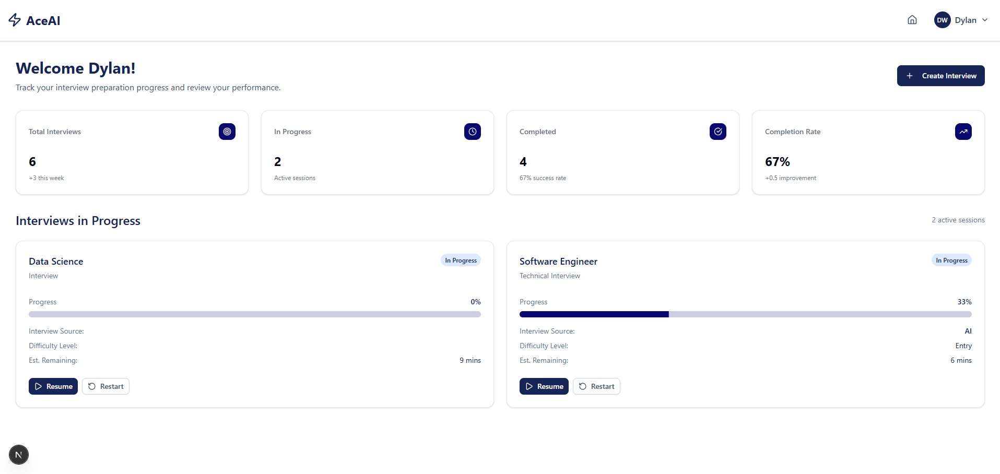
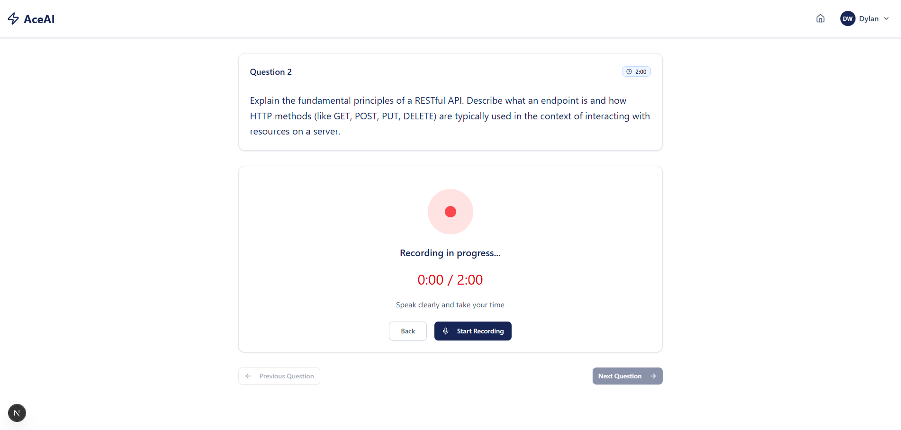

# AceAI – AI Interview Preparation and Feedback Platform

AceAI is an AI-powered interview preparation platform that generates personalized interview questions, transcribes spoken responses, and provides structured feedback using large language models.

The goal is to help job seekers practice interviews in a realistic environment and receive actionable feedback on their responses

<div align="center">
  
  &nbsp;
  
</div>

## Demo

[](https://youtu.be/sWzxdNbWSwo)

## Key Capabilities

- LLM integration for structured evaluation of interview responses
- Speech-to-text pipeline for voice-based interview practice
- Secure authentication and database integration with Supabase
- Real-time API communication between a React frontend and FastAPI backend

## Features

- **AI-Generated Interviews**: Create custom interviews based on job descriptions or choose from popular categories like Software Engineering, Product Management, and more.
- **Real-time Interaction**: Answer questions via voice (with speech-to-text) or text.
- **Smart Feedback**: Receive instant, detailed feedback on your responses, including scores for Content Quality, Clarity, and Completeness.
- **Progress Tracking**: Monitor your interview history and improvement over time via the dashboard.
- **Modern UI**: A clean, responsive interface built with Next.js and Tailwind CSS.

## Tech Stack

- **Frontend**: Next.js, React, Tailwind CSS, Framer Motion
- **Backend**: FastAPI, Python
- **AI**: Google Gemini (Generative AI)
- **Database & Auth**: Supabase

## Architecture

Frontend (Next.js) → FastAPI Backend → Gemini API  
                             ↓  
                     Supabase Database

The application uses a full-stack architecture:

- **Frontend:** Next.js handles UI and user interaction.
- **Backend:** FastAPI processes interview logic and AI requests.
- **AI Layer:** Google Gemini evaluates responses and generates feedback.
- **Database:** Supabase stores interviews, responses, and feedback results.

## Motivation

I built AceAI to help job seekers practice interviews in a more structured way. Many interview preparation tools generate questions but do not provide actionable feedback. This project explores how large language models can simulate a hiring manager's evaluation process and help candidates improve their responses over time.

## Getting Started

### Prerequisites

- Node.js & npm
- Python 3.8+
- Supabase Account
- Google Cloud API Key (Gemini)

### Installation

1. **Clone the repository**
   ```bash
   git clone https://github.com/yourusername/ace-ai.git
   ```

2. **Backend Setup**
   ```bash
   cd backend
   pip install -r requirements.txt
   # Configure .env with API_KEY, SUPABASE_URL, SUPABASE_KEY
   uvicorn server:app --reload
   ```

3. **Frontend Setup**
   ```bash
   cd frontend
   npm install
   # Configure .env.local with NEXT_PUBLIC_SUPABASE_URL, NEXT_PUBLIC_SUPABASE_ANON_KEY
   npm run dev
   ```

4. **Run the App**
   Open [http://localhost:3000](http://localhost:3000) to view it in the browser.


## Future Improvements

- Improve the AI evaluation model to provide more detailed and nuanced feedback
- Deploy the application with a hosted frontend and backend
- Implement analytics to track user progress over multiple interview sessions

## Contact
- Dylan Wettlaufer – dwettla3@uwo.ca
- [LinkedIn](https://www.linkedin.com/in/dylan-wettlaufer-729b842ab/)